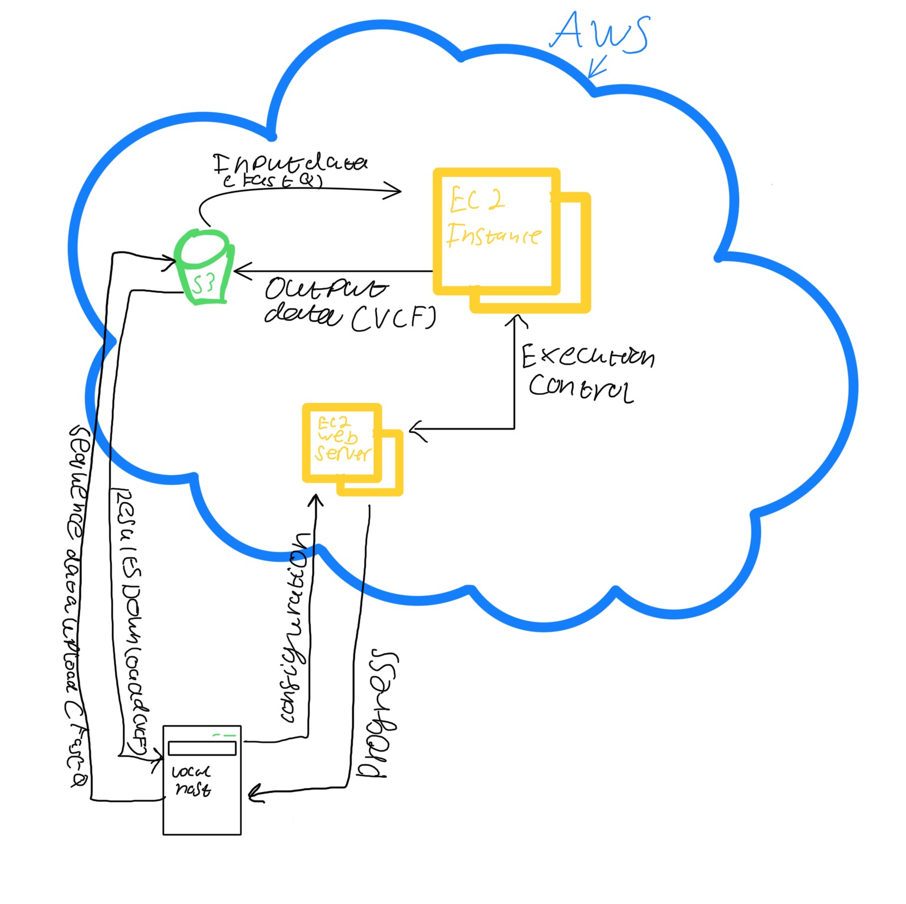
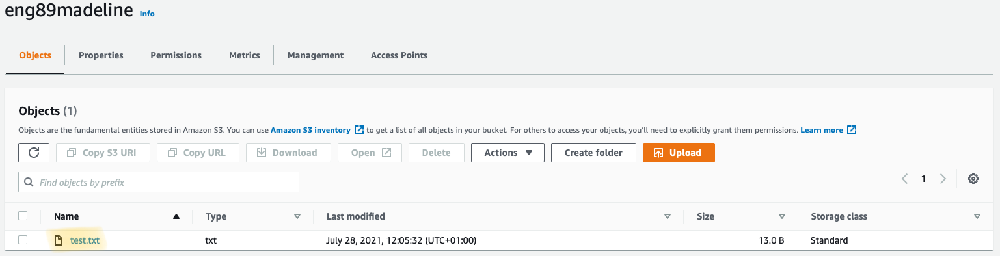

# Disaster recovery plan
## CRUD
- Create
- Read
- Update
- Delete

Pre-requisites for this lesson:
- SSH into your EC2 in the same region
- AWS access and secret keys
- We’ll set up an AWS CLI (command line interface)
- Apply CRUD from using AWSCLI from our EC2 instance

## Creating an S3 bucket
- `aws s3 mb s3://nameofbucket`
    - mb stands for “make bucket”
- Upload a file: `aws s3 cp test.txt s3://nameofbucket`

And here it is:

- And to copy it back: `sudo aws s3 cp s3://nameofbucket/test.txt test.txt`